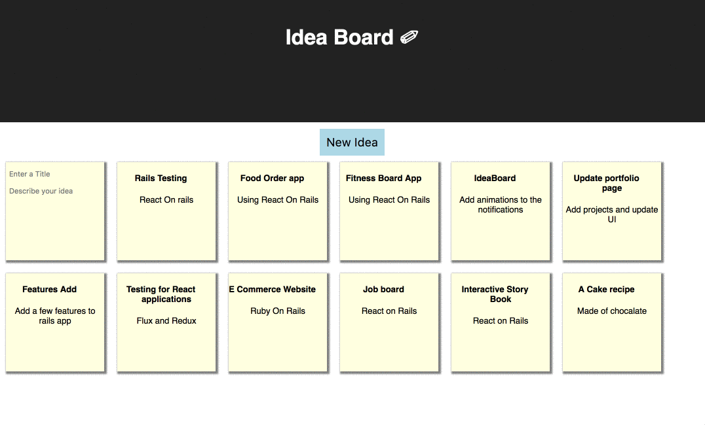

# Ideaboard App

An Ideaboard App, An React application built using Create React app, interacts with the [Ideaboard-Rails-API](https://github.com/sowmyadsl/Ideaboard-Rails-API) that I created.

The application responds to an API which has endpoints for creating, updating , editing and deleting ideas from ideaboard.

This project was bootstrapped with [Create React App](https://github.com/facebookincubator/create-react-app).

# Screenshot

### Dependencies
* <a href="https://github.com/kolodny/immutability-helper">immutability-helper</a>
* <a href="https://github.com/mzabriskie/axios">axios</a>

## Application Includes:

1. A visual page where the users can click on the new idea button and create ideas dynamically on the same page.
2. Ability to update, edit and delete ideas and able to make a response to API back and forth to create crud functions in the application.
3. An alert shows up when user creates, updates an idea.

## Further Exploration:

- Add a category for ideas and create a filter to search from various categories of ideas.
- Add authentication for users to save the ideas to their profile
- Add testing for react application.

## Installation

###First clone and run the Rails API

In your terminal:

* `git clone https://github.com/sowmyadsl/Ideaboard-Rails-API`
* `cd Ideaboard-Rails-API`
* `bundle install`
* Open another terminal window and type `postgres`.  Leave this window open.
* In your first terminal window type:
* `bundle exec rake db:setup`
* `bundle exec rake db:test:prepare`

You can test the API in Postman.

* URL: localhost:3001/api/v1/ideas

### Now clone and run the Ideaboard

In your terminal:
* `git clone https://github.com/sowmyadsl/ideaboard`
* `cd ideaboard`
* `npm install -g create-react-app`

## Development server

In this Rails API directory:
Run `bundle exec rails -p 3001` for a dev server. The app will automatically reload if you change any of source files.

In Ideaboard directory:
* Run `npm start` and navigate to `http://localhost:3000/`.

## Technologies Used

* Rails
* Reactjs
* JavaScript ES6
* CSS

## Known Bugs
_N/A_

## Support and contact details

_I encourage you to update/refactor this code. Please contact Sowmya Dinavahi at sowmya.dsl@gmail.com with questions._

### License
*This software is licensed under the MIT license*
Copyright © 2017 **Sowmya Dinavahi**
